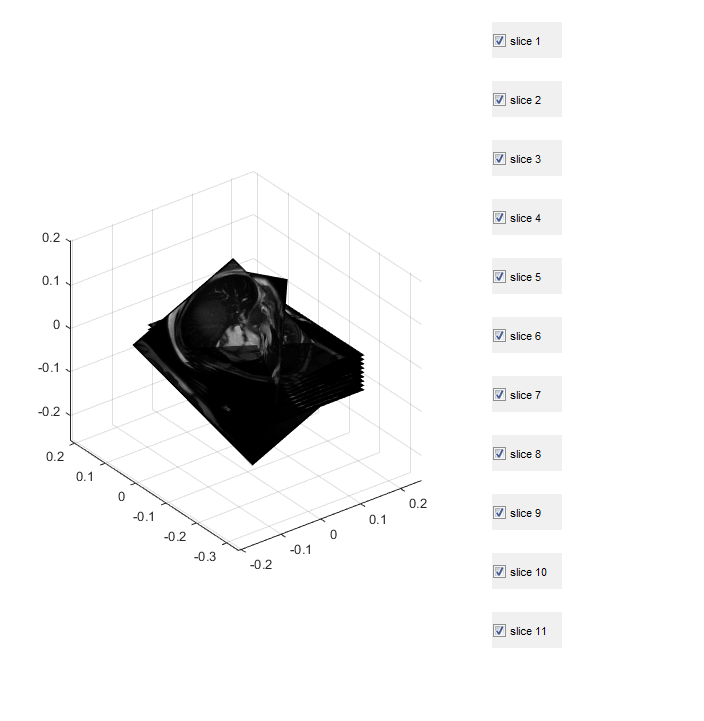

# DICOM_resampling
Use this code to resample 2D and 3D medical images in matlab

The matlab code in this repository is used to resample 2D and 3D medical imaging data (raw DICOM). Either insert slices into a volume or extract slices from a volume. It was developed for MRI but should works with others too. I have used it on various MRI (cardiac, abdominal, whole body...) as well as abdominal CT.

You will need the Gerardus toolbox https://github.com/vigente/gerardus to run the files.
It is all based on the scimat format, as used in the Gerardus repository. 

## Files

### scimat_insert_extract.m
This function resamples data. If a 2D (stack or single) image is set as output and a 3D as its output, the function will generate a synthetic acquisition based on the metadata of both files. If, on the other hand, 3D is set as the output and 2D as the input, the 2D data will be inserted into a 3D array. It is meant to be used to populate an empty volume, generated with the function scimat_make3dframe.m below.

### scimat_squeeze_time.m
This function removes the time dimension. Needed because this works with static frames only.

### scimat_make3Dframe.m
This function created an empty 3D scimat array. Needed when 2D data is to be inserted into an empty 3D array. 

The code was developed for the optimisation algorithm in the following paper. 

* Basty, N., McClymont, D., Teh, I., Schneider, J.E. and Grau, V., 2017. Reconstruction of 3D Cardiac MR Images from 2D Slices Using Directional Total Variation. In Molecular Imaging, Reconstruction and Analysis of Moving Body Organs, and Stroke Imaging and Treatment (pp. 127-135). Springer, Cham.

At every iteration, the resampling function (scimat_insert_extract.m) is used to generate synthetic slices to be compared with the ground truth as well as inserting 2D data back into the 3D volume that is being reconstructed.

# Example figures
## 2D slices in 3D

## 2D slices in 3D (reoriented)

## Extracted long axis slices - You can see the thick short axis slices in the extracted long axis slices

## isotropic (thin) slices in isotropic 3D volume

## anisotropic (thick) slices in isotropic 3D volume

## anisotropic slices in isotropic 3D volume (reoriented)

